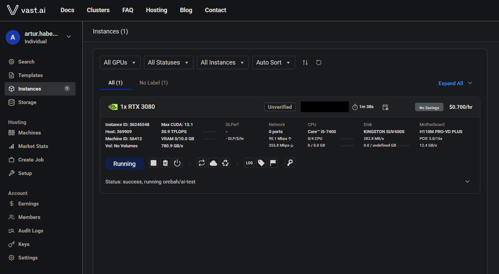
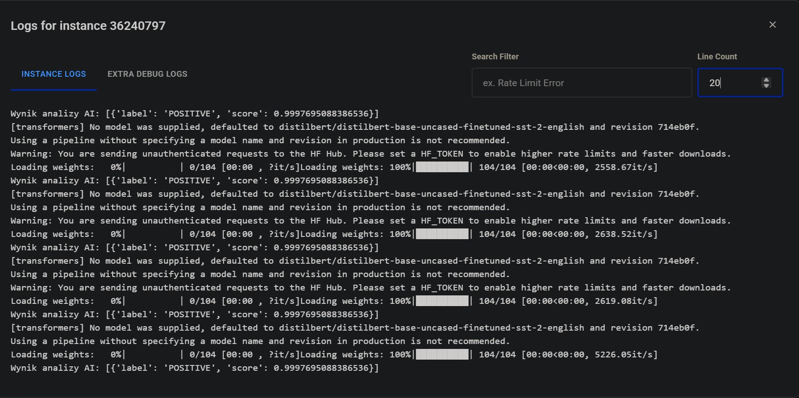
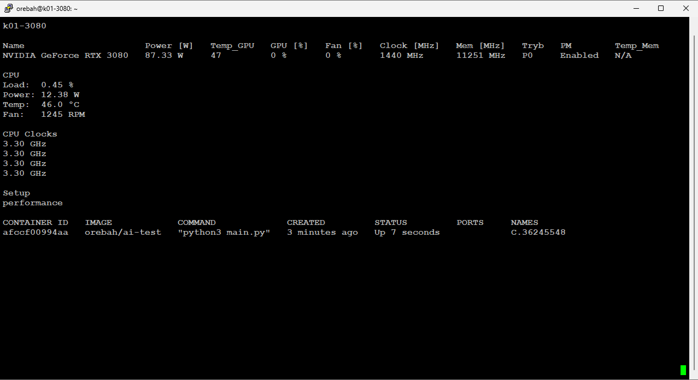

Cel: Wdrożenie skalowalnego systemu analizy AI (Hugging Face) na infrastrukturze hybrydowej GPU.  
Automatyzacja: Pełny potok MLOps obejmujący GitHub Actions, automatyczny build obrazu na Docker Hub oraz deployment na własnym serwerze listowanym na Vast.ai.  
Technologie: Python, PyTorch, Docker, NVIDIA CUDA 13.1, Ubuntu 24.04.  
Rezultat: Stabilna, kontenerowa aplikacja wykonująca obliczenia neuronowe bezpośrednio na dedykowanych kartach RTX 3080.

### Dowód wdrożenia i wyniki (Screenshots)

*Rys 1. Widok panelu Vast.ai z aktywną instancją RTX 3080 i uruchomionym obrazem AI-test.*

*Rys 2. Wyniki analizy sentymentu wygenerowane przez model Hugging Face.*

*Rys 3. Statystyki systemowe oraz status kontenera Docker na maszynie k01.*
